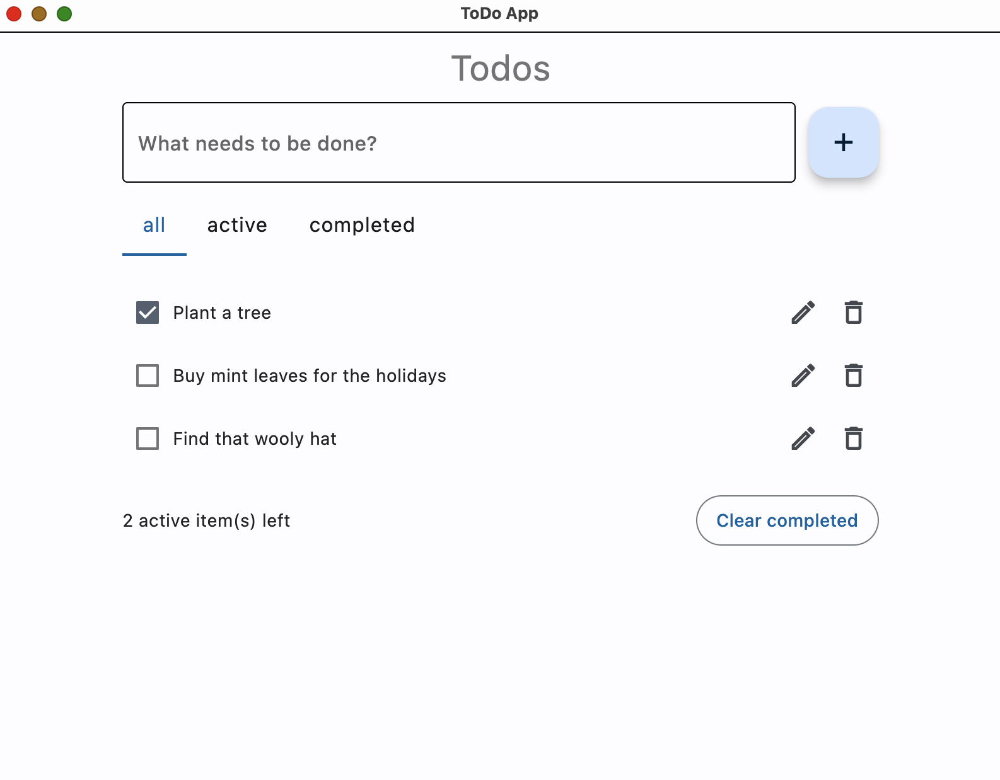

# Flet To-Do App

This basic app allows the user to create a todo list.

The user can edit, delete, and mark the tasks completed.

The App filters the tasks by status: active, completed, all.

The App is a single file of ~160 lines of code.

